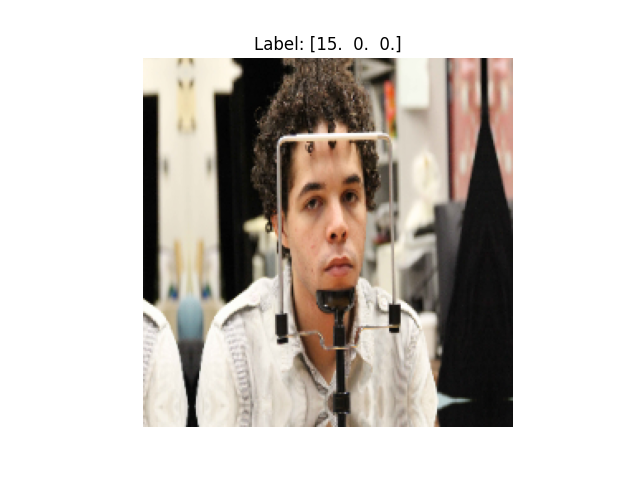
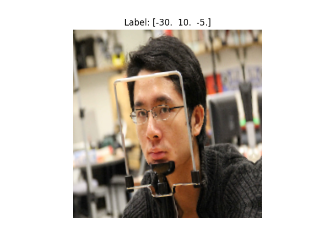
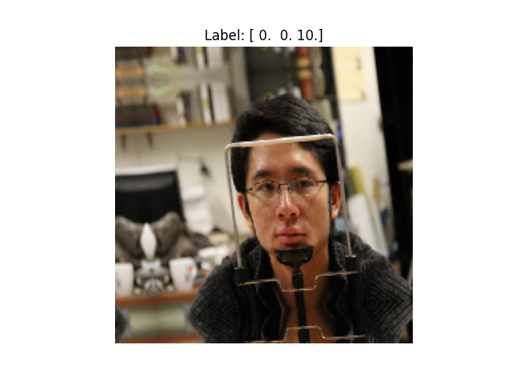
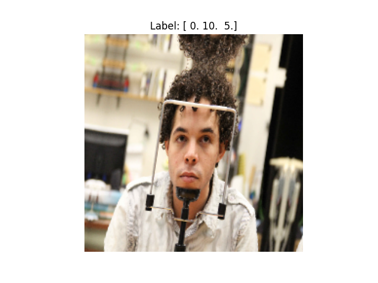
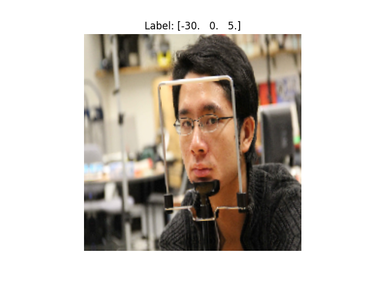

# head_pose_estimation_focus
This repository contains the implementation of a project aimed at head pose estimation using a custom Convolutional Neural Network (CNN). The project utilizes the Columbia Gaze dataset, involving steps from data preprocessing, creating synthetic labels for attention and distraction, to training a custom CNN model.

<!DOCTYPE html>
<html lang="en">
<head>
    <meta charset="UTF-8">
    <meta name="viewport" content="width=device-width, initial-scale=1.0">
    <title>Head Pose Estimation Project</title>
    
</head>
<body>
    <h1>Head Pose Estimation Project</h1>
    
This project aims to estimate head poses (attention and distraction) using a custom Convolutional Neural Network (CNN). The dataset used is the Columbia Gaze dataset. The project involves the following steps:

    <ol>
        <li>Data Preprocessing</li>
        <li>Feature Extraction</li>
        <li>Creating Synthetic Labels</li>
        <li>Training a Custom CNN Model</li>
    </ol>
    <h2>Data Preprocessing</h2>
    
The data preprocessing step involves loading the images and extracting the head pose information from the filenames. The images are resized to 224x224 pixels and normalized. Here are some sample images from the training set:

    

        
        
        
        
        
    

    <h2>Feature Extraction</h2>
    
Feature extraction is performed using a pre-trained VGG16 model. The model is loaded with the ImageNet weights, and the feature maps are extracted from the convolutional layers. These features are then used as input for the custom CNN model.

    <h3>Understanding VGG16</h3>
    
The VGG16 model is a convolutional neural network architecture developed by the Visual Geometry Group at the University of Oxford. It is composed of 16 layers, including 13 convolutional layers and 3 fully connected layers. The model uses small 3x3 filters and max-pooling layers to reduce the spatial dimensions of the feature maps. VGG16 is widely used for image classification and object detection tasks due to its depth and ability to capture complex features. By using the pre-trained VGG16 model, we leverage its learned features from the ImageNet dataset, which helps in achieving better performance with less training data.

    
For a detailed explanation of the VGG16 model, you can refer to the following sources:

    <ul>
        <li><a href="https://neurohive.io/en/popular-networks/vgg16/" target="_blank">VGG16 - Convolutional Network for Classification and Detection</a></li>
        <li><a href="https://builtin.com/data-science/vgg16-keras" target="_blank">Beginners Guide to VGG16 Implementation in Keras</a></li>
        <li><a href="https://www.geeksforgeeks.org/vgg-16-cnn-model/" target="_blank">VGG16 | CNN model - GeeksforGeeks</a></li>
    </ul>

    <h2>Creating Synthetic Labels</h2>
    
Synthetic labels are generated based on the head pose information. If the pitch, yaw, and roll values are within a certain threshold, the label is marked as attention (focused). Otherwise, it is marked as distraction (not focused).

    <h2>Training the Custom CNN Model</h2>
    
The custom CNN model is trained using the extracted features and synthetic labels. The model architecture consists of multiple convolutional layers, max-pooling layers, and dense layers with dropout for regularization. The model is trained with data augmentation techniques to improve generalization.

    <h2>Results</h2>
    
The trained model is evaluated on the test set, and the test accuracy is reported. The model's performance indicates its ability to accurately classify head poses as attention or distraction.

    <h2>Conclusion</h2>
    
This project demonstrates the use of deep learning techniques for head pose estimation. The custom CNN model, trained with augmented data and synthetic labels, shows promising results in classifying head poses based on the Columbia Gaze dataset.

</body>
</html>

